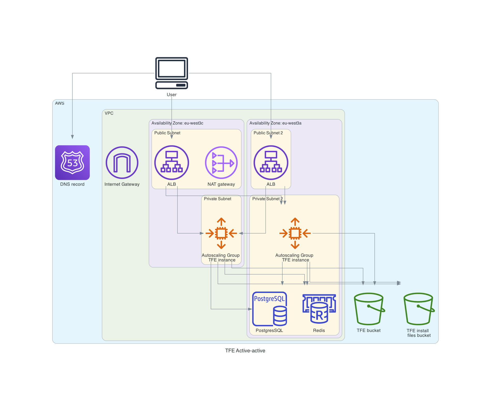

# Terraform Enterprise Active-Active installation with valid certificates on AWS  
This repository installs an Online Terraform Enterprise (TFE) Active-Active with valid certificates in AWS.  

This terraform code creates
- A VPC
- Subnets
- Internet gateway
- NAT gateway
- Route Tables
- Key pair
- Security group
- Security group rules
- S3 Buckets
- PostgreSQL Database
- Elasticache Redis DB
- An Elastic IP
- A Route53 DNS entry
- Valid certificates
- A load balancer
- An Autoscaling Group
- ASG launch templates
  - Replicated configuration
  - TFE settings json
  - Install TFE airgapped
  - TFE Admin account

# Diagram


# Prerequisites
 - An AWS account
 - A TFE license

# How to install TFE active-active with valid certficates on AWS
- Clone this repository.  
```
git clone https://github.com/paulboekschoten/tfe-aws-active-active.git
```

- Go to the directory 
```
cd tfe-aws-active-active
```

- Save your TFE license in `config/license.rli`.  

- Rename `terraform.tfvars_example` to `terraform.tfvars`.  
```
mv terraform.tfvars_example terraform.tfvars
```

- Change the values in `terraform.tfvars` to your needs.

- Set your AWS credentials
```
export AWS_ACCESS_KEY_ID=
export AWS_SECRET_ACCESS_KEY=
export AWS_SESSION_TOKEN=
```

# Create single node TFE first
In your `terraform.tfvars` file the following should be set:
```
min_size                = 1
max_size                = 1
desired_capacity        = 1
active_active           = false
```

- Terraform initialize
```
terraform init
```
- Terraform plan
```
terraform plan
```

- Terraform apply
```
terraform apply
```

Terraform output should show 50 resources to be created with output similar to below. 
```
Apply complete! Resources: 50 added, 0 changed, 0 destroyed.

Outputs:

public_ip = "35.181.185.144"
release_sequence = 725
tfe_login = "https://tfe-active-online.paul-boekschoten.aws.sbx.hashicorpdemo.com"
```
It can take up to 10 minutes for the environment to become ready.  
When ready, go to the `tfe_login` page and log in with your credentials.  
Create your organization and a workspace.  

# Switch to active-active
In your `terraform.tfvars` file the following should be set:
```
min_size                = 1
max_size                = 2
desired_capacity        = 2
active_active           = true
```

- Terraform plan
```
terraform plan
```
```
Terraform will perform the following actions:

  # aws_autoscaling_group.tfe will be updated in-place
  ~ resource "aws_autoscaling_group" "tfe" {
      ~ desired_capacity                 = 1 -> 2
        id                               = "tfe-active-online"
      ~ max_size                         = 1 -> 2
        name                             = "tfe-active-online"
        # (24 unchanged attributes hidden)

      ~ launch_template {
          ~ id      = "lt-015b9a321045ae1a1" -> "lt-0cbc8137031393587"
            name    = "tfe-active-online"
            # (1 unchanged attribute hidden)
        }

        # (1 unchanged block hidden)
    }

Plan: 0 to add, 1 to change, 0 to destroy.
```

- Terraform apply
```
terraform apply
```
```
Apply complete! Resources: 0 added, 1 changed, 0 destroyed.
```

The running EC2 instance will be terminated and 2 new EC2 instances will be created by the autoscaling group.  

# TODO

# DONE
- [x] Create manually
- [x] Add diagram
- [x] Create VPC
- [x] Create Subnets
- [x] Create Internet gateway
- [x] Change default Route Table
- [x] Create Key pair
- [x] Create security groups
- [x] Create a security group rules
- [x] Create an EC2 instance
- [x] Create EIP
- [x] Create DNS record
- [x] Create valid certificate
- [x] Create S3 bucket
- [x] Create PostgreSQL database
- [x] Create Redis cluster
- [x] Create load balancer
- [x] Create autoscaling group
- [x] Create launch templates 
  - [x] Create settings.json
  - [x] Create replicated.conf
  - [x] Copy certificates
  - [x] Copy license.rli
  - [x] Create admin user
- [x] Documentation