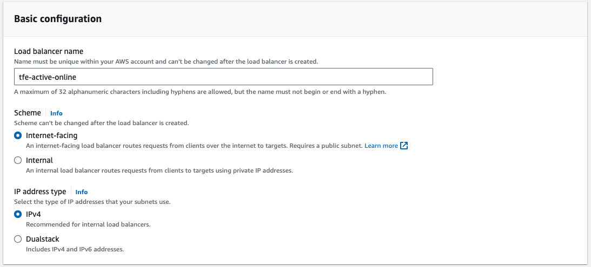

# Manual installation of TFE (Online), active-active on AWS

Here it is described how to manually install Airgapped Terraform Enterpise (TFE) with external services (PostgreSql and S3) and a valid certificate on AWS.  

Official installation documentation can be found [here](https://www.terraform.io/enterprise/install/interactive/installer).  

# Prerequisites
- AWS account
- TFE license


# How to

As a basis the https://github.com/paulboekschoten/tfe_external_services_online repository is used.
This will install an External Services TFE.

Engineering manual: https://developer.hashicorp.com/terraform/enterprise/install/automated/active-active


Todo:  
- [x] Remove EC2 instance 
- [x] Adjust port in security group
- [x] Add NAT gateway 
- [x] Add public subnet
- [x] Add route table
- [x] Add a Redis instance  
- [x] Add a loadbalancer  
- [x] Add an autoscaling group 
- [x] Update Route53 to point to loadbalancer  
- [ ] Write terraform code  
- [ ] Update the TFE configuration  
- [ ] Disable Replicated admin UI  
 


## Remove EC2 instance
In AWS, go to your instances, select the instance.  
Under `Instance state`, click `Terminate Instance`.  
  
In the following screen, confirm by clicking `Terminate`.

## Adjust security group
Go to security groups, click on your security group and click `Edit inbound rules`.  
  

## Add NAT gateway
Go to VPC NAT gateways and click `Create NAT gateway`.  
Provide a name  
Select your VPC  
Select your public subnet  
Select your EIP  
  
Click `Create Nat gateway`  

## Add a public subnet
The loadbalancer requires 2 subnets, and must be placed in public subnets to be reachable from internet.  
Go to subnets and click `Create subnet`.  
Select your vpc.  
Provide a name.  
Select an Availability Zone that is different from the first public subnet.  
Enter an CIDR range that lies within your VPC but is different from other subnets.  
  
Click `Create subnet`.  

## Add a route table for private subnets
Go to route tables and click `Create route table`.  
Provide a name.  
Select your VPC.  

Click `Create route table`.  

Go to the tab `Routes` and click `Edit routes`.  
Click `Add route`  
Set destination to `0.0.0.0/0`  
Under Target select your NAT gateway  
  
Click `Save changes`  

Go to the tab `Subnet associations` and click `Edit subnet associations` in `Explicit subnet associations`.    
Select you private subnets  
 
Click `Save associations`  

## Adjust exiting route table
Go to Route Tables and click on `tfe-active-online-rtb`  
Go to the tab `Subnet associations` and click `Edit subnet associations` in `Explicit subnet associations`.    
Select you public subnets.    
  
Click `Save associations`  

## Add Redis instance
Go to `ElastiCache` and then `Subnet groups`, click `Create subnet group`. 
  

Provide a name and a description.  
Select your VPC. 
  
Click `Create`.  

Go to `ElastiCache` and click `Get started`.  
  

Click `Create cluster` under option 2, then select `Create Redis cluster`.  
  

Select `Configure and create a new cluster`.  
  

Provide a name and a description.  
  

Select `AWS Cloud` and disable `Multi AZ` and `Auto-failover`.  
  

Select `cache.t3.small` for `Node type` and set the `Number of replicas` to 0. 
   

Choose your subnet group created previously.  
  

Click `Next`.  

Click on `Manage` and select your security group.  
  

Disable automatic backups.  


Click `Next`.  

Click `Create`.  

## Add Target Groups
Go to EC2 Target groups and click `Create target group`  
Select `instances` under target type.  
Provide a name.  
Set the protocol to HTTPS.  
Select your VPC.  
  

Select the HTTPS protocol for the health check
Change the path to `/_health_check`.  

Click `Next`.  
Click `Create target group`.  

## Add Load Balancer
Go to EC2 Load Balancers and click `Create load balancer`.  

Click `Create` under Application Loadbalancer 
  

Provide a name.  
  

Select your VPC and 2 public subnets.  
  

Remove the default security group and add your own.  
  

Add the listners and connect them to the target groups.  
  

Set the `Default SSL/TLS certificate` to import and provider the certs and private key.  
  

Click `Create load balancer`.  

## Add Launch Template
Go to Auto Scaling groups  
Go to Launch Templates  
Click `Create launch template`  

Provide a name and a description  
  

Select your OS image  
  
Ubuntu 22.04 LTS jammy

Select your instance type  
  
m5.xlarge

Select your key-pair  
  

Select the first private subnet, select the security group  
  


Expand and set the size to `100`, the type to `io` and the IOPS to `1000`
  

Expand Advanced details and select the IAM profile  
  

Scroll down to user data  
  

And fill in the following:
```
#cloud-config
packages:
- git 
- jq 
- vim 
- language-pack-en
- wget
- curl
- zip
- unzip
- ca-certificates
- gnupg
- lsb-release
write_files:
  - path: "/etc/replicated.conf"
    permissions: "0755"
    owner: "root:root"
    content: |
      {
        "DaemonAuthenticationType":     "password",
        "DaemonAuthenticationPassword": "Password#1",
        "TlsBootstrapType":             "server-path",
        "TlsBootstrapHostname":         "tfe-active-online.tf-support.hashicorpdemo.com",
        "TlsBootstrapCert":             "/tmp/tfe_server.crt",
        "TlsBootstrapKey":              "/tmp/tfe_server.key",
        "BypassPreflightChecks":        true,
        "ImportSettingsFrom":           "/etc/settings.json",
        "LicenseFileLocation":          "/tmp/license.rli"
      }
  - path: "/etc/settings.json"
    permissions: "0755"
    owner: "root:root"
    content: |
      {
        "hostname": {
            "value": "tfe-active-online.tf-support.hashicorpdemo.com"
        },
        "enc_password": {
            "value": "Password#1"
        },
        "aws_instance_profile": {
           "value": "1"
        },
        "s3_bucket": {
            "value": "tfe-active-online-bucket"
        },
        "s3_region": {
            "value": "eu-west-3"
        },
        "pg_dbname": {
            "value": "tfe"
        },
        "pg_extra_params": {
            "value": "sslmode=require"
        },
        "pg_netloc": {
            "value": "tfe-active-online-postgres.c3zibg8wqccx.eu-west-3.rds.amazonaws.com:5432"
        },
        "pg_password": {
            "value": "Password#1"
        },
        "pg_user": {
            "value": "postgres"
        },
        "placement": {
            "value": "placement_s3"
        },
        "production_type": {
            "value": "external"
        }
      }
  - path: "/etc/tfe_initial_user.json"
    permissions: "0755"
    owner: "root:root"
    content: |
      {
        "username": "tfe_admin",
        "email": "paul.boekschoten@hashicorp.com",
        "password": "Password#1"
      }
  - path: "/tmp/install-tfe.sh"
    permissions: "0755"
    owner: "root:root"
    content: |
      #!/bin/bash -eux
      private_ip=$(curl http://169.254.169.254/latest/meta-data/local-ipv4)

      curl -sL https://install.terraform.io/ptfe/stable > /tmp/install.sh
      bash /tmp/install.sh release-sequence=725 no-proxy private-address=$private_ip
      
      while ! curl -kLsfS --connect-timeout 5 https://tfe-active-online.tf-support.hashicorpdemo.com/_health_check &>/dev/null ; do
        echo "INFO: TFE has not been yet fully started"
        echo "INFO: sleeping 60 seconds"
        sleep 60
      done

      echo "INFO: TFE is up and running"

      if [ ! -f /etc/iact.txt ]; then
        initial_token=$(replicated admin --tty=0 retrieve-iact | tr -d '\r')
        echo $initial_token > /etc/iact.txt
      fi

      curl -k \
        --header "Content-Type: application/json" \
        --request POST \
        --data @/etc/tfe_initial_user.json \
        https://tfe-active-online.tf-support.hashicorpdemo.com/admin/initial-admin-user?token=$initial_token | tee /etc/tfe_initial_user_token.json
runcmd: 
  - sudo apt-get -y update
  - curl "https://awscli.amazonaws.com/awscli-exe-linux-x86_64.zip" -o "/tmp/awscliv2.zip"
  - unzip /tmp/awscliv2.zip -d /tmp/
  - sudo /tmp/aws/install
  - aws s3 cp s3://tfe-active-online-filesbucket/license.rli /tmp/
  - aws s3 cp s3://tfe-active-online-filesbucket/tfe_server.crt /tmp/
  - aws s3 cp s3://tfe-active-online-filesbucket/tfe_server.key /tmp/
  - bash /tmp/install-tfe.sh
```

Click `Create launch template`  

## Add Auto Scaling Group
Go to Auto Scaling groups  
Click `Create Auto Scaling group`  

Provide a name and select your launch template
  
Click `Next`  

Select your VPC and private subnet
  
Click `Next`  

Select existing load balancer and select the target groups.  
  
Click `Next`  

Leave the capacity settings on 1.  
Click `Next` until the review page.  

Click `Create Auto Scaling group`.  

## Point the DNS to the load balancer
Go to your Route53 hosted zone and edit your DNS record.  
  

Click `Alias`  
Select to Application and Classic Load Balancer.  
Select your region.  
Select your Load Balancer.  
  
Click `Save`


# Switch to active-active
https://developer.hashicorp.com/terraform/enterprise/install/automated/active-active

Make sure the following ports are enabled:  
- 6379 (for Redis)  
- 8201 (for Vault High Availability mode)  

Port 8800 can be closed, as the Replicated Admin UI will be disabled.  
This is done in the previous steps.  

For the following steps you need to edit the launch template.  
Go to Launch Templates and select your luanch template.  
Under Actions click on `Modify template (Create new version`.  )
  

Provide a template version description.  
  

Scroll down to `Advanced details` and expand.  
Scroll down to `User data`.  

- Make sure the release sequence is pinned.
Find the line for the `install.sh` and check `release-sequence` is set.  
```
bash /tmp/install.sh release-sequence=725 no-proxy private-address=$private_ip
```

- Set active-active mode
Find the line with `  - path: "/etc/settings.json"`.  
Under `content`  add the following:  
```
"enable_active_active" : {
    "value": "1"
  },
```

- Configure external Redis
Find the line with `  - path: "/etc/settings.json"`.  
Under `content`  add the following:  
```
    "redis_host" : {
      "value": "tfe-active-online-redis.q1a0ms.0001.euw3.cache.amazonaws.com:6379"
    },
    "redis_port" : {
      "value": "6379"
    },
    "redis_use_password_auth" : {
      "value": "0"
    },
    "redis_use_tls" : {
      "value": "0"
    },
```
Replace the redis_host with your actual value of the Redis endpoint. 
Can be found in the node of your redis cluster.  
  

- Encryption password
Make sure you have set an encryption password, this needs to be the same for all TFE nodes.  
Find the line with `  - path: "/etc/settings.json"`.  
Under `content` following should exist: 
```
"enc_password": {
            "value": "Password#1"
        },
```

Click `Create template version`.  

Go back to you auto scaling group and check the new version is being used.  
  
Under Launch template description, you should see the description you set for the new Luanch template.  

For the changes to take effect, a new instance will need to be provisioned.  
Terminate the existing instance by scaling down to zero. Once terminated, you can scale back up to one instance using your revised configuration.

  
Click Edit and set all values to 0.  

Check your EC2 instances to see that it gets teminated.  

Once terminated, set the scaling values back to 1. Not higher!

When running

- Disable the UI 
Find the line for the `install.sh` and `disable-replicated-ui`.  
```
bash /tmp/install.sh disable-replicated-ui release-sequence=${release_sequence} no-proxy private-address=$private_ip public-address=$public_ip
```

Now you can scale up to two nodes.  

Note:  
When installing TFE for the first time, this needs to be done with active-active off:  
```
"enable_active_active" : {
    "value": "0"
  },
```